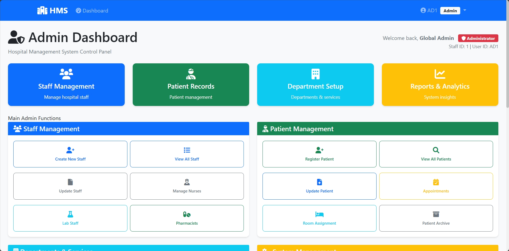
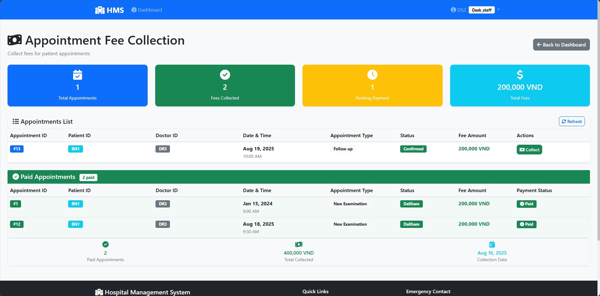
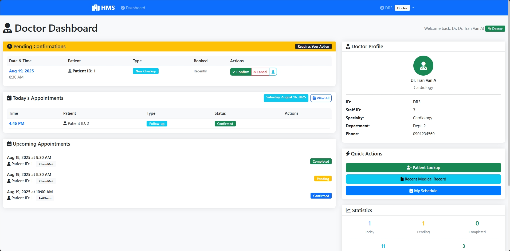
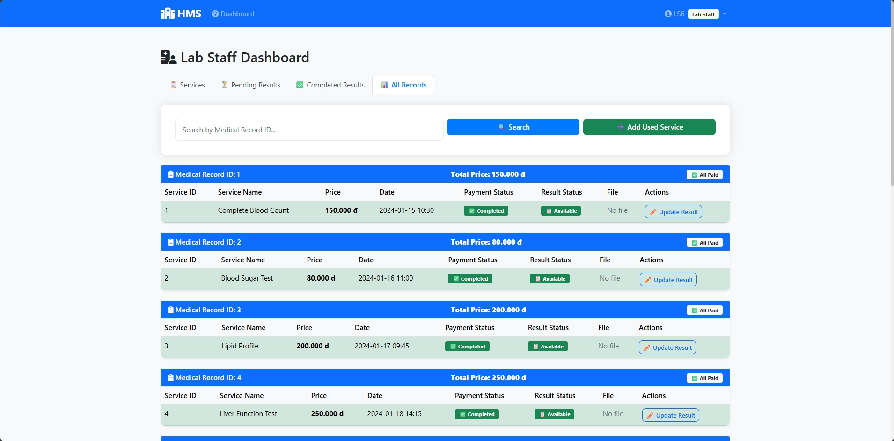

<a name="readme-top"></a>

# DApp - QLBenhVien and Microservices

-   Group project from HCMUS's 2025 Distributed Applications course.
-   Watch our [demo video](https://youtu.be/xqwWUNcCvx0) on YouTube.

<div align="center">
    
    
</div>
<div align="center">
    
    
</div>

## Getting Started

### Prerequisites

-   [MAMP](https://www.mamp.info/en/windows/) >= 5.0.6.
-   [Python](https://www.python.org/downloads/) >= 3.11.
-   [PostgreSQL](https://www.postgresql.org/) >= 17.5.
-   [Docker Desktop](https://docs.docker.com/desktop/) >= 4.43.2.

> [!IMPORTANT]
> If PostgreSQL is installed on Windows 11, remember to add its `bin` to the system PATH. E.g., `D:\PostgreSQL\17\bin`.

### Installation

1. Clone the repo.

    ```console
    https://github.com/phongan1x5/UDPT_QLBV.git
    ```

1. Install dependencies for [`setup.py`](setup.py).

    ```python
    pip install -r requirements.txt
    ```

    > It is highly advisable to work with a [`venv`](https://docs.python.org/3/library/venv.html) to avoid issues.

1. Run [`setup.py`](setup.py) to make a default `.env` file for each microservice, and create template superuser (db owner) and all needed databases for Postgres.

    ```console
    setup.py [-h] [--option OPTION] [--clean_install CLEAN_INSTALL] postgres_password

    py setup.py postgres_password --option install --clean_install True
    ```

1. Deploy the microservices.

    ```console
    cd microservices
    docker compose up
    ```

### Uninstallation

> [!IMPORTANT]
> Take care to close all connections in Postgres, and `docker compose down` with microservices.

1. Manually clean up the container with Docker Desktop.

1. Run [`setup.py`](setup.py) to remove the corresponding items in Postgres.

    ```console
    py setup.py postgres_password --option uninstall
    ```

## Usage

-   Read [CLC_DoAnThucHanh-UDPT](./documents/CLC_DoAnThucHanh-UDPT.pdf) for requirements and [Report](./documents/Report.pdf) for details.
-   Watch our [demo video](https://youtu.be/xqwWUNcCvx0) on YouTube.
-   Premade accounts can be found in [./helper/setup_hospital_db.sql](./helper/setup_hospital_db.sql), at the `INSERT` for `users` table. All passwords are `password123`.

The client is hosted on `http://localhost/UDPT_QLBV/client`. When calling microservices,

-   Use the base API Gateway URL of `http://localhost:6000`,
-   And refer to [./microservices/api_gateway/routes.py](./microservices/api_gateway/routes.py) for routing details.

The URLs for all microservices can be found in:

-   [`./microservices/api_gateway/database.py`](./microservices/api_gateway/database.py).

    ```python
    MICROSERVICE_URLS = {
        'auth': 'http://auth_service:6001',
        'patient': 'http://patient_service:6002',
        'staff': 'http://staff_service:6003',
        'appointment': 'http://appointment_service:6004',
        'lab': 'http://lab_service:6005',
        'pharmacy': 'http://pharmacy_service:6006',
        'medical_record': 'http://medical_record_service:6007',
        'notification': 'http://notification_service:6008',
    }
    ```

-   Or through the console.

    ```console
    > cd microservices
    > docker compose ps

    NAME                                     IMAGE                                  COMMAND                   SERVICE                  CREATED              STATUS              PORTS
    microservices-api_gateway-1              microservices-api_gateway              "uvicorn main:app --…"   api_gateway              6 days ago           Up About a minute   0.0.0.0:6000->6000/tcp, [::]:6000->6000/tcp
    microservices-appointment_service-1      microservices-appointment_service      "uvicorn main:app --…"   appointment_service      6 days ago           Up About a minute   0.0.0.0:6004->6004/tcp, [::]:6004->6004/tcp
    microservices-auth_service-1             microservices-auth_service             "uvicorn main:app --…"   auth_service             6 days ago           Up About a minute   0.0.0.0:6001->6001/tcp, [::]:6001->6001/tcp
    microservices-lab_service-1              microservices-lab_service              "uvicorn main:app --…"   lab_service              6 days ago           Up About a minute   0.0.0.0:6005->6005/tcp, [::]:6005->6005/tcp
    microservices-medical_record_service-1   microservices-medical_record_service   "uvicorn main:app --…"   medical_record_service   6 days ago           Up About a minute   0.0.0.0:6007->6007/tcp, [::]:6007->6007/tcp
    microservices-notification_service-1     microservices-notification_service     "uvicorn main:app --…"   notification_service     About a minute ago   Up About a minute   0.0.0.0:6008->6008/tcp, [::]:6008->6008/tcp
    microservices-patient_service-1          microservices-patient_service          "uvicorn main:app --…"   patient_service          6 days ago           Up About a minute   0.0.0.0:6002->6002/tcp, [::]:6002->6002/tcp
    microservices-pharmacy_service-1         microservices-pharmacy_service         "uvicorn main:app --…"   pharmacy_service         6 days ago           Up About a minute   0.0.0.0:6006->6006/tcp, [::]:6006->6006/tcp
    microservices-staff_service-1            microservices-staff_service            "uvicorn main:app --…"   staff_service            6 days ago           Up About a minute   0.0.0.0:6003->6003/tcp, [::]:6003->6003/tcp
    ```

## Meet The Team

<div align="center">
  <a href="https://github.com/phongan1x5"></a>&nbsp;&nbsp;&nbsp;
  <a href="https://github.com/kru01"></a>&nbsp;&nbsp;&nbsp;
  <a href="https://github.com/TriVo131003"></a>&nbsp;&nbsp;&nbsp;
</div>

<p align="right">(<a href="#readme-top">back to top</a>)</p>
